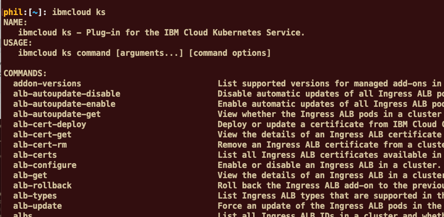

# Practical Container Orchestration Workshop
---
# Preparing the labs
---


Before you can run all the labs about container orchestration, you should prepare your environment to execute those labs. Check the following instructions.

Labs are running on the **IBM Cloud** (ex Bluemix).


# Task 1. IBM Cloud registration

**<u>Skip This task if you already have an IBM cloud account</u>** 

So before you can start any labs, you should have satisfied the following prerequisites :
- [ ] You should have **1 valid email** 

- [ ] Sign up to the **IBM Cloud** 

> If you don't have a valid email address or if you don't want to use your personal or professional email address, then you can use a temporary email at  https://temp-mail.org/en/

This web site will give you a temporary email address for 10 minutes :


From that screen,  you can use this temporaty email address (cugebezaza@utooemail.com for example) for the time to register to the IBM Cloud. 

### Sign in to IBM Cloud
If you don't have already registered to **IBM Cloud**,  
Open this link  [IBM Cloud](https://cloud.ibm.com/) or type https://cloud.ibm.com/ in your favorite internet browser.


### Fill in the form
Specify last name, first name, country, phone number and password.
> By **default**, all new people that register to IBM Cloud will have an **Lite Account** with **no time restriction**. This is not a 30 day trial account. 

Click on **Create Account** button.

 


Then if everything is fine, you will receive the following page:


### Confirm your registration to IBM Cloud from your inbox
From your email application , you should have received an email from the IBM Cloud:


Click on the link to confirm the account:


Log in to IBM Cloud with your credentials :


Then type your password and click **Continue**


Type your password and click Login button:


You should see the following **Dashboard**:


You are now connected (and registred) to the IBM Cloud.

> IMPORTANT : Take a note of your email address and your password.


# Task 2. Apply a promo code (if necessary)

<u>**Skip This task if you already have access to IBM Kubernetes Service**</u>

Check if you can access to **Kubernetes Service**.
To do so, click on **Catalog** and click on **Containers** on the left pane of the page :


> **IMPORTANT** : If you just see **Container Registry** and not the Containers in Kubernetes Clusters, then **you will need a promo code !!!**

> **IMPORTANT** : If you don't have a **promo code**, then ask IBM during the workshop. You can continue the other steps of this preparation and come back later to this step. However, to create a cluster, you will need a promo code.

To install a promo code, follow the procedure : 

Go to **Manage >Account > Account Settings** and press enter.


You should get the following section in the **account setting page**  :


Click **Apply Code** button.


Enter your **promo code** and click **Apply** 


> Close this window and **logout / login** to your account.

Go back to the **Catalog** and check that now you have access to **Kubernetes Service** and the Container Registry.


# Task 3. Install Docker Desktop on your Mac

**<u>Skip This task if you already have Docker installed on your Mac</u>**

Follow this procedure to install the latest Docker Desktop (ex Community Edition) on your Mac (**for Windows**, jump to the next session) 

Docker Desktop for Mac is favailable for free.

https://store.docker.com/editions/community/docker-ce-desktop-mac


Click on the blue button **Please Login to Download**. If you are not registred to the Docker site, then create an account. Then when you are registered and logged in, click on the **Get Docker ** button.


Double-click **Docker.dmg** to start the install process.

When the installation completes and Docker starts, the whale in the top status bar shows that Docker is running, and accessible from a terminal.


Open a terminal and type :

`docker version`

You should see something similar to this screen :
```console
> docker version
Client: Docker Engine - Community
 Version:           18.09.1
 API version:       1.39
 Go version:        go1.10.6
 Git commit:        4c52b90
 Built:             Wed Jan  9 19:33:12 2019
 OS/Arch:           darwin/amd64
 Experimental:      false

Server: Docker Engine - Community
 Engine:
  Version:          18.09.1
  API version:      1.39 (minimum version 1.12)
  Go version:       go1.10.6
  Git commit:       4c52b90
  Built:            Wed Jan  9 19:41:49 2019
  OS/Arch:          linux/amd64
  Experimental:     true

```
> Note that you should always have the client and the server running.

> The Docker server contains the **Docker engine**(containerd) that controls running containers. 


# Task 4. Install Docker Desktop on Windows

**<u>Skip This task if you already have Docker installed on you Windows 10</u>**

Follow this procedure to install the latest Docker Desktop (ex Community Edition) on Windows (for Mac, jump to the previous session) 

> Windows operating system should be Windows 10 Pro or higher. 

Docker Desktop for Windows is available for free.

https://store.docker.com/editions/community/docker-ce-desktop-windows


Click on the blue button **Please Login to Download**. If you are **not** registred to the Docker site, then create an account. Then when you are registered and logged in, click on the **Get Docker ** button.


Leave the default parameters: 


After download, install Docker Desktop:

**Double-click Docker for Windows Installer** to run the installer.

> **IMPORTANT**: During the installation process, you may be informed the installer will reboot your workstation to install the virtualization feature of your PC. 


When the installation finishes, Docker starts automatically. The **whale** in the notification area indicates that Docker is running, and accessible from a terminal.

Open a command-line terminal like PowerShell, and try out some Docker commands!

Run docker version to check the version.

`docker version`

You should see something similar to this screen :
```console
> docker version
Client: Docker Engine - Community
 Version:           18.09.1
 API version:       1.39
 Go version:        go1.10.6
 Git commit:        4c52b90
 Built:             Wed Jan  9 19:33:12 2019
 OS/Arch:           darwin/amd64
 Experimental:      false

Server: Docker Engine - Community
 Engine:
  Version:          18.09.1
  API version:      1.39 (minimum version 1.12)
  Go version:       go1.10.6
  Git commit:       4c52b90
  Built:            Wed Jan  9 19:41:49 2019
  OS/Arch:          linux/amd64
  Experimental:     true
```
> Note that you should always have the client and the server running.

> The Docker server contains the **Docker engine** (containerd) that controls running containers. 


# Task 5. Install Git on your laptop

**<u>Skip This task if you already have GIT on your laptop</u>**

To install Git : 

On MacOS :
http://mac.github.com

On Windows: 
http://git-scm.com/download/win

At some point during the installation, change to the **"Use Windows default console"** and continue the installation.


# Task 6. Install the ibmcloud command

**<u>Skip This task if you already have ibmcloud and plugin installed on your laptop</u>**

The **ibmcloud** command line interface (CLI) provides a set of commands that are grouped by namespace for users to interact with IBM Cloud. In previous versions, the name of that command was "bluemix" or "bx".

You install a set of IBM Cloud commands and tools, verify the installation, and configure your environment. IBM® Cloud developer tools offer a command-line approach to creating, developing, and deploying end-to-end web, mobile, and microservice applications.


Find more information here for more installation approaches :

<https://cloud.ibm.com/docs/cli/reference/ibmcloud?topic=cloud-cli-install-ibmcloud-cli#install_use>


**For MacOS :**

https://clis.cloud.ibm.com/download/bluemix-cli/latest/osx


**For Windows :**

https://clis.cloud.ibm.com/download/bluemix-cli/latest/win64


Then test your command (open a terminal or a command line) :	

` ibmcloud`


Install the 2 plugins :

```
ibmcloud plugin install kubernetes-service
ibmcloud plugin install container-registry
```

Results

```console
> ibmcloud plugin install kubernetes-service
Looking up 'kubernetes-service' from repository 'IBM Cloud'...
Plug-in 'container-service/kubernetes-service 0.2.99' found in repository 'IBM Cloud'
Do you want to update it with 'container-service/kubernetes-service 0.2.99' or not? [y/N]> y
Attempting to download the binary file...
 24.18 MiB / 24.18 MiB [=======================================] 100.00% 10s
25353300 bytes downloaded
Installing binary...
OK
Plug-in 'container-service 0.2.99' was successfully installed into /Users/phil/.bluemix/plugins/container-service. Use 'ibmcloud plugin show container-service' to show its details.

> ibmcloud plugin install container-registry
Looking up 'container-registry' from repository 'IBM Cloud'...
Plug-in 'container-registry 0.1.380' found in repository 'IBM Cloud'
Plug-in 'container-registry 0.1.373' was already installed. Do you want to update it with 'container-registry 0.1.380' or not? [y/N]> y
Attempting to download the binary file...
 3.33 MiB / 24.45 MiB [=========================================] 100.00% 43s
25640616 bytes downloaded
Installing binary...
OK
Plug-in 'container-registry 0.1.380' was successfully installed into /Users/phil/.bluemix/plugins/container-registry. Use 'ibmcloud plugin show container-registry' to show its details.

```

Check your commands:

  `ibmcloud cr`


` ibmcloud cs` or `ibmcloud ks` : these are the same commands




# Task 7. Login to IBM Cloud

Login to IBM Cloud with the ibmcloud command :

 `ibmcloud login`

 And answer a few questions: email, password :

```console
ibmcloud login
API endpoint: https://api.ng.bluemix.net

Email> vatazi@easymail.top

Password> 
Authenticating...
OK

Targeted account va tazi's Account (6af9653fe1d644ee998627937a26547e)

Targeted resource group Default

                      
API endpoint:      https://api.ng.bluemix.net   
Region:            us-south   
User:              vatazi@easymail.top   
Account:           va tazi's Account (6af9653fe1d644ee998627937a26547e)   
Resource group:    Default   
CF API endpoint:      
Org:                  
Space:                

Tip: If you are managing Cloud Foundry applications and services
- Use 'ibmcloud target --cf' to target Cloud Foundry org/space interactively, or use 'ibmcloud target --cf-api ENDPOINT -o ORG -s SPACE' to target the org/space.
- Use 'ibmcloud cf' if you want to run the Cloud Foundry CLI with current IBM Cloud CLI context.


```

**You are now ready to start the other labs**.


# Task 8. Conclusion

###  Results
<span style="background-color:yellow;">Successful exercise ! </span>
You finally went thru the following features :
- [x] You registered to IBM Cloud
- [x] You applied a promo code
- [x] You installed Docker on your laptop
- [x] You installed Git
- [x] You installed the ibmcloud commands
- [x] You login to IBM Cloud successfully
- [x] You are ready for the labs
---
# End of the lab
---
# Practical Container Orchestration Workshop 
---
